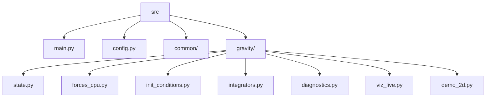

# Architecture Overview

Source layout (flat `src/`):

- `src/main.py` – CLI entry stub.
- `src/config.py` – shared configuration (simulation parameters, central mass, initial conditions).
- `src/common/` – logging and other utilities.
- `src/gravity/` – gravitational simulation (Phase 1: 2D; Phase 2: 3D).

Future: replay export and a client-side WebGL viewer (separate layer loading exported data).

## gravity

- **state.py** – `ParticleState` (positions, velocities, masses); central star is particle index 0.
- **forces_cpu.py** – Newtonian gravity with softening (loop and vectorized).
- **init_conditions.py** – `make_disk_2d`, `make_cloud_2d`, `make_uniform_2d`.
- **integrators.py** – Euler and Leapfrog.
- **diagnostics.py** – kinetic/potential energy, angular momentum, `SimulationLog`.
- **viz_live.py** – live 2D scatter (star + particles, optional coloring).
- **demo_2d.py** – run loop with CLI, diagnostics, live viz.

Outputs go under `outputs/frames/` and `outputs/runs/` as needed.
